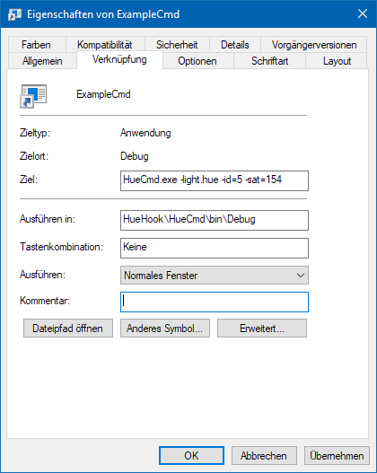

# HueCmd
Control your Philips Hue system with simple Windows shortcuts or from the command line.

## How to use

Before the first program start, a settings file must be created. You can modify the example file, found in [../ExampleData/HueCmdSettings.xml](https://github.com/100prznt/HueHook/blob/master/ExampleData/HueCmdSettings.xml). The file must be in the same directory as the program and named `HueCmdSettings.xml`. See next point [Settings](#settings) for detailed informations.

### Settings
The program settings are stored in a xml-formated file, named `HueCmdSettings.xml`.
This file have one root node `<HueHookSettings>`, which have two __required__ child nodes.

|Node               |Description                                          |
|-------------------|-----------------------------------------------------|
|`<BridgeIp>`       |IP address of the Philips Hue Bridge                 |
|`<BridgeUsername>` |authorized user on the Philips Hue Bridge*           |

An example you can find under [ExampleData/HueCmdSettings.xml](https://github.com/100prznt/HueHook/blob/master/ExampleData/HueCmdSettings.xml).

\* to get an new username see the [Getting Started](https://developers.meethue.com/login/) article on the *hue developer program*.

The program must be started with at least the required parameters (:warning:). And one or more further allowed parameters (:heavy_check_mark:) can be appended.

|Description       |Name  |Value      |Light             |Group             |Scene             |
|------------------|------|-----------|:----------------:|:----------------:|:----------------:|
|:warning: Object  |      |           |`-light.hue`      |`-group.hue`      |`-scene.hue`      |
|:warning: ID      |`-id` |0 - 254    |:heavy_check_mark:|:heavy_check_mark:|:heavy_check_mark:|
|On state          |`-on` |0, 1       |:heavy_check_mark:|:heavy_check_mark:|:x:               |
|Hue               |`-hue`|0 - 65535  |:heavy_check_mark:|:heavy_check_mark:|:x:               |
|Saturation        |`-sat`|0 - 254    |:heavy_check_mark:|:heavy_check_mark:|:x:               |
|Brightness        |`-bri`|0 - 254    |:heavy_check_mark:|:heavy_check_mark:|:x:               |
|Color Temperature |`-ct` |153 - 500  |:heavy_check_mark:|:heavy_check_mark:|:x:               |

:warning: required parameter &nbsp; :heavy_check_mark: parameter allowed &nbsp; :x: parameter not allowed

### Examples

#### Command Line
`HueCmd.exe -light.hue -id=1 -on=1 -bri=127`

This means, switch on the light with ID 1 and setup the brightness to a value of 127.

#### Windows Shortcut
You can obtain this parameters also with a windows shortcut.

## Releases
This program is part of the [HueHook](https://github.com/rmmlr/huehook) project. You can find the release in the [HueHook Release](https://github.com/100prznt/huehook/releases)

More details you can find under: [HueHook Releases](https://github.com/100prznt/HueHook#releases)

## Credits

* **Elias Ruemmler** - *Initial work* - [100prznt](https://github.com/100prznt)

Under [Contributors](https://github.com/100prznt/HueHook/contributors) you can see more project supporter.

### Open Source Project Credits

* [Q42.HueApi](https://github.com/Q42/Q42.HueApi) C# helper library to talk to the Philips Hue bridge 

## License

This project (HueHook) is licensed under  [MIT License](http://www.opensource.org/licenses/mit-license.php "Read more about the MIT license form").  
Refer to [LICENSE](https://github.com/100prznt/HueHook/blob/master/LICENSE.txt) for more information.

 
